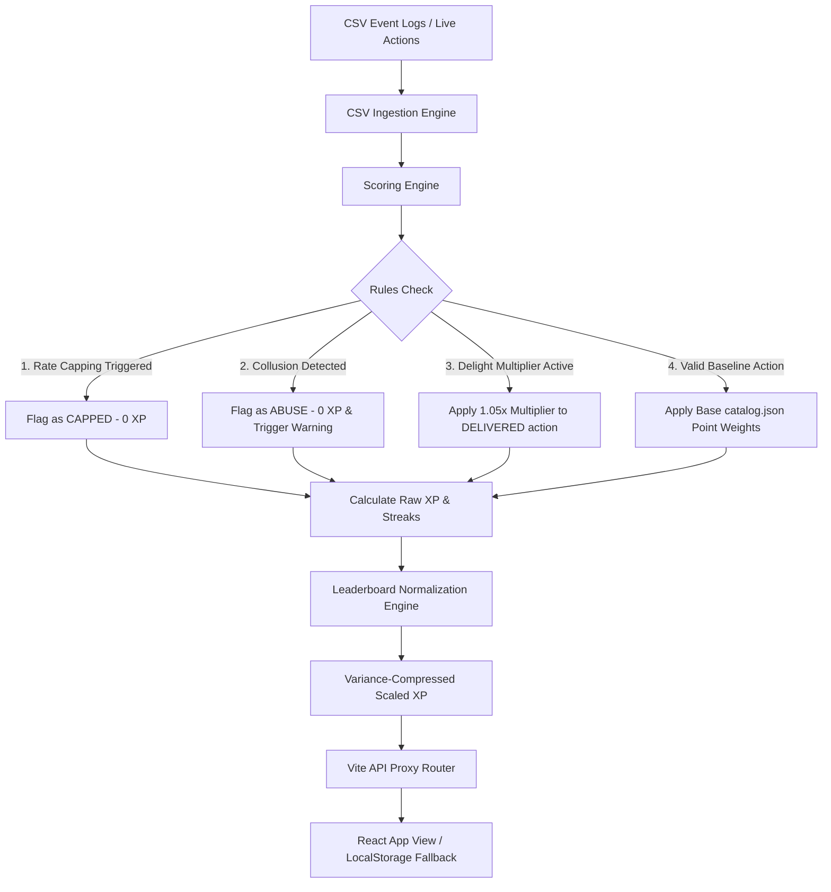

# DealerXP

**Compete. Collaborate. Deliver.**

DealerXP is a high-performance gamification and analytics platform built on top of real-world car dealership operational lifecycles. It sits directly on top of raw dealership transactional events (Lead → Enquiry → Booking → Finance → Invoice → Delivery), processing them into actionable scoring indicators (XP, Streaks, Badges, Quests, and Leaderboards). It is designed to optimize cycle times, prevent operational collusion, restrict low-effort spamming, and foster cross-department teamwork.

Built for the Carverse Mobility Technologies Dealership Gamification Hackathon.

---

## 📖 Table of Contents

- [1. Repository Structure & File Explanations](#1-repository-structure--file-explanations)
- [2. System Architecture & Ingestion Flow](#2-system-architecture--ingestion-flow)
- [3. Deep-Dive Pipelines](#3-deep-dive-pipelines)
  - [3.1. CSV Event Ingestion Pipeline](#31-csv-event-ingestion-pipeline)
  - [3.2. Dynamic Scoring Pipeline](#32-dynamic-scoring-pipeline)
  - [3.3. Anomaly & Collusion Blocker Pipeline](#33-anomaly--collusion-blocker-pipeline)
  - [3.4. Normalization & Variance Compress Pipeline](#34-normalization--variance-compress-pipeline)
- [4. Core Game Mechanics](#4-core-game-mechanics)
- [5. Anti-Gaming Guardrails](#5-anti-gaming-guardrails)
- [6. Progression & Rank Tiers](#6-progression--rank-tiers)
- [7. Tech Stack](#7-tech-stack)
- [8. Quick Start Guide](#8-quick-start-guide)
- [9. Testing Suite](#9-testing-suite)

---

## 1. Repository Structure & File Explanations

The repository is organized into a clean decoupled backend and frontend architecture:

```
DealerXP/
├── backend/                       # FastAPI Python Backend
│   ├── app/
│   │   ├── api/v1/                # Route Handlers / API Controllers
│   │   │   ├── admin_routes.py    # Admin configurations & live action catalog overrides
│   │   │   ├── auth_router.py     # Simple login credentials authentication
│   │   │   ├── dashboard_routes.py# Legacy/Lobby general metrics routes
│   │   │   ├── leaderboard_routes.py# Rank ladder and employee lookup api routes
│   │   │   └── user_routes.py     # User profiles and telemetry retrieval
│   │   ├── data/                  # Event Logs, Employee and Location CSV datasets
│   │   ├── engines/               # Core Ingestion, Scoring, and Analysis Engines
│   │   │   ├── anomaly_detector.py# Rules checking collusion & velocity warning violations
│   │   │   ├── gamification_engine.py# Streak trackers, daily quests, and badges checker
│   │   │   ├── leaderboard_engine.py# Normalization scaler & individual/department ladders
│   │   │   └── scoring_engine.py  # Action catalog loader and baseline scoring calculator
│   │   ├── services/              # Business Logic & Runtime Data Layer
│   │   │   ├── action_catalog_service.py # Live loading of 20 scoreable actions
│   │   │   ├── analytics_service.py # Manager KPIs, cycle times, and alert summaries
│   │   │   ├── department_service.py# Department vs Department competition records
│   │   │   ├── notification_service.py# In-app achievements notifications broker
│   │   │   ├── runtime_state.py   # Thread-safe in-memory cache for event states
│   │   │   └── user_service.py    # Operations analyzer and coach welcome triggers
│   │   └── main.py                # FastAPI Application initialisation
│   ├── tests/                     # Integration and unit tests (Pytest)
│   └── requirements.txt           # Python application dependencies
│
├── frontend/                      # React 18 + Vite + Tailwind CSS Frontend
│   ├── src/
│   │   ├── api/
│   │   │   └── client.js          # Fetch wrapper querying backend with localStorage fallbacks
│   │   ├── components/            # Reusable UI Components
│   │   │   └── dashboard/
│   │   │       ├── AICoachPopup.jsx # Floating coach window with preloaded advice
│   │   │       └── LoginForm.jsx  # Employee selector login gateway
│   │   ├── pages/                 # Full Dashboard Page Modules
│   │   │   ├── AchievementsPage.jsx # Unlocked milestones catalog list
│   │   │   ├── AdminPanelPage.jsx   # Live scoring weight adjustment console
│   │   │   ├── AnalyticsPage.jsx    # SaaS Vercel-style Manager/Personal KPI cockpit
│   │   │   ├── BookingTimelinePage.jsx# Interactive Race Track booking lifecycle visualizer
│   │   │   ├── DashboardPage.jsx    # Lobby Hub holding the Team Wins Social Feed
│   │   │   ├── DseDashboardPage.jsx # Sales DSE pipeline task panel
│   │   │   ├── FinanceDashboardPage.jsx# Finance Specialist approval task panel
│   │   │   ├── LeaderboardPage.jsx  # Division rivals rank ladder view
│   │   │   ├── ProfilePage.jsx      # Individual achievements scorecard summary
│   │   │   └── RewardsPage.jsx      # Battle-pass style milestone progression track
│   │   ├── App.jsx                # Collapsible sidebar layouts, states, and client routing
│   │   ├── index.css              # Global custom typography, dark overrides, and tailwind base
│   │   └── main.jsx               # React DOM Entrypoint
│
├── shared/
│   └── action_catalog.json        # Unified catalog of the 20 actions and baseline weights
├── database/seed/                 # Script assets for populating data logs
└── docker-compose.yml             # Single-command infrastructure layout
```

---

## 2. System Architecture & Ingestion Flow

DealerXP handles both historical processing and real-time user-generated actions through a single scoring pipeline:



---

## 3. Deep-Dive Pipelines

### 3.1. CSV Event Ingestion Pipeline
* **Batch Processing**: The backend reads raw operational events from `backend/app/data/z_event_log_may_june_2026.csv` during initial startup.
* **Metadata Join**: Events are joined with employee profiles (`z_employees.csv`) and locations (`z_locations.csv`) using pandas-based matching.
* **Action Classification**: Raw event log codes are classified into exactly **20 core gamified actions** matching the catalog definition in `shared/action_catalog.json`.

### 3.2. Dynamic Scoring Pipeline
* **Baseline Calculation**: Evaluates the baseline XP points according to the active action weights (e.g. `DELIVERED = 300 XP`, `PDI_COMPLETED = 100 XP`).
* **Multipliers Application**: If a user has an active Customer Delight Multiplier (awarded from a simulated 5-star customer feedback review), the pipeline intercepts their next `DELIVERED` action, scales the XP award by **1.05x**, and resets the multiplier state.
* **Streak Modifiers**: Daily streak counters assess consecutive operational activity. If an employee logs scoring actions across consecutive calendar days, the active streak count is incremented, and streak milestones award bonus XP.

### 3.3. Anomaly & Collusion Blocker Pipeline
* **Sequence Mapping**: Tracks lifecycle sequences on active bookings. For instance, when a DSE submits documentation and a Finance specialist approvals it, the sequence is verified.
* **Blocker Check-gates**: If the handoff sequence occurs repeatedly without a real lifecycle milestone progress (e.g., repeatedly logging notes or uploading documentation back-and-forth), the detector intercepts, awards **0 points**, flags the action as `"COLLUSION_ABUSE"`, and creates a warning alert.

### 3.4. Normalization & Variance Compress Pipeline
* **Scale Compression**: To prevent top performers from running away with leaderboards, the `leaderboard_engine.py` runs a normalization function mapping raw accumulated points into a range between `80 XP` and `520 XP`:
  $$\text{Scaled XP} = 80 + \frac{\text{Raw XP} - \text{Min Raw XP}}{\text{Max Raw XP} - \text{Min Raw XP}} \times 440$$
* **Rank Redistribution**: Preserves relative rankings while ensuring the competitive spread remains tight, giving newcomers realistic opportunities to promote their rank division.

---

## 4. Core Game Mechanics

### 1. Booking Racetrack (Timeline)
* Maps real-time booking milestones to a visual racetrack timeline containing **7 major check-gates** (Booking Created → Discount Approved → Finance Approved → Invoice Approved → RTO Request → PDI Completed → Delivered).
* Displays a sports car indicator moving right across the timeline as stages complete.

### 2. Customer Delight Multiplier
* Converts customer satisfaction scores into scoring multipliers:
  * ⭐⭐⭐⭐⭐ (5 Stars) $\rightarrow$ **1.05x Multiplier**
  * ⭐⭐⭐⭐ (4 Stars) $\rightarrow$ **1.03x Multiplier**
  * ⭐⭐⭐ (3 Stars) $\rightarrow$ **1.01x Multiplier**
* The multiplier is automatically applied to boost their next vehicle delivery action (`DELIVERED`) and resets.

### 3. Relay Collaboration Bonus
* Rewards cross-department alignment. If a Sales DSE and a Finance Specialist complete successive milestone steps on the same booking ID, both are credited with a **Relay Collaboration Bonus (+50 XP)**.

### 4. Rewards Battle-Pass
* A horizontal progression track containing **6 rewards milestones** (such as *Rookie Elite*, *Relay Champion*, *Customer Delight Master*, etc.).
* Milestones are hard to unlock, requiring strict checks: high cumulative XP, minimum daily streak days, and validated delivery milestones.

### 5. Team Wins Social Feed
* Located in the Lobby Dashboard. Allows employees to post their operational wins, which adds the corresponding XP directly to their scorecard.
* Colleagues can react via "claps" and post supportive comments to cheer their team.

### 6. AI Coach Popup
* A floating assistant in the bottom-right corner. It initializes with a static diagnostic feed displaying four curated optimization advices (Welcome Streak Analysis, Note Cap Advisory, Delight Multiplier status, and Collaboration relay hints).

---

## 5. Anti-Gaming Guardrails

To protect leaderboard integrity, the scoring pipeline implements strict check-gates:

| Guardrail | Trigger Event | Operational Rule | Penalty |
| :--- | :--- | :--- | :--- |
| **Daily Rate Capping** | `BOOKING_NOTE_ADDED` | Max 5 note additions daily | Subsequent notes receive **0 XP** and are marked `CAPPED`. |
| **Collusion Block** | Back-and-forth note/doc logging | Must advance a delivery stage | Handoff bonus is blocked (**0 XP**) and flags warnings. |
| **Velocity Cap** | PDI/RTO logs velocity | Max 3 operations per booking | PDI logs exceeding limit receive **0 XP** to prevent note spamming. |

---

## 6. Progression & Rank Tiers

DealerXP maps progression across 100-point brackets, uniform across all frontend components and backend scoring engines:

| Rank Badge | Rank Tier | Point Bracket |
| :---: | :--- | :--- |
| 🪨 | **Iron** | 0 – 99 XP |
| 🥉 | **Bronze** | 100 – 199 XP |
| 🥈 | **Silver** | 200 – 299 XP |
| 🟡 | **Gold** | 300 – 399 XP |
| 💎 | **Platinum** | 400 – 499 XP |
| 💠 | **Diamond** | 500+ XP |

---

## 7. Tech Stack

| Layer | Technologies |
| :--- | :--- |
| **Frontend** | React 18, React Router v6, Tailwind CSS, Framer Motion, Recharts, Lucide React |
| **Backend** | FastAPI (ASGI Framework), Pydantic (validation), Pandas (CSV processing engine) |
| **Database & Cache** | PostgreSQL, Redis |
| **Testing** | Pytest |
| **Development** | Vite (Dev proxy and hot-module replacement) |

---

## 8. Quick Start Guide

### Option A — Full Stack (Docker Compose)
To run the fully integrated database, cache, backend api, and frontend client:
```bash
docker-compose up --build
```
* **Frontend Access**: [http://localhost:5173](http://localhost:5173)
* **Backend API Docs**: [http://localhost:8000/docs](http://localhost:8000/docs)

To seed transactional historical logs:
```powershell
# Windows PowerShell
.\scripts\seed_db.sh
```

### Option B — Standalone Frontend (Local mock state)
The frontend contains dynamic local storage fallbacks, allowing you to run, edit, and demo the interface standalone:
```bash
cd frontend
npm install --legacy-peer-deps
npm run dev
```
Access [http://localhost:5173](http://localhost:5173).

### Option C — Standalone Backend
To start only the FastAPI server:
```bash
cd backend
# Create and activate virtual environment
python -m venv venv
venv\Scripts\activate   # On Windows
source venv/bin/activate # On Unix/macOS
# Install dependencies and start uvicorn
pip install -r requirements.txt
python -m uvicorn app.main:app --port 8000 --reload
```

---

## 9. Testing Suite

To execute the verification test suite covering points normalisation, collusion check-gates, caps triggers, and API schemas:
```bash
cd backend
venv\Scripts\python.exe -m pytest tests/ -v
```

---
*Copyright © Carverse Mobility Technologies Pvt Ltd*
