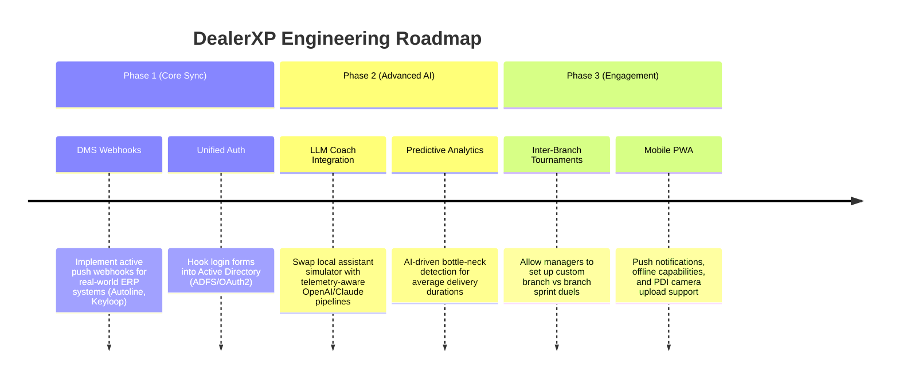

# DealerXP — Product Features & Future Advancements Roadmap

DealerXP is a gamified telemetry and analytics workspace designed to sits on top of raw transactional logs in car dealerships. By reconstructing event sequences into a standardized, high-performance competitive layer, it optimizes cycle times, aligns incentives across sales and finance divisions, and actively alerts managers to collusion or note-farming abuse.

This document lists all currently implemented features and details the strategic roadmap for future engineering advancements.

---

## 1. Currently Implemented Features

### 1.1. Lobby Hub & Social Wins Feed
* **Interactive Compositor**: Employees can select standard operational events (like *Vehicle Delivered*, *PDI Completed*, or *Finance Approved*) and share custom victory notes (e.g., Mr. Kapoor’s Seltos handoff) directly with the branch.
* **Instant Score Syncing**: Posting a win dynamically credits the employee's scorecard with the corresponding XP points, providing immediate gamification feedback.
* **Peer Engagement**: Supports clicking "claps" and sending cheers/comments under colleagues' shared wins to build collaboration and support.
* **LocalStorage Persistence**: Post arrays, claps, and comment feeds are stored in browser storage to ensure they persist across page refreshes and demo presentations.

### 1.2. Booking Timeline "Race Track"
* **Lifecycle Reconstructor**: Maps complex booking transaction histories into a linear lifecycle containing **7 key operational phases** (Booking Created $\rightarrow$ Discount Approved $\rightarrow$ Finance Approved $\rightarrow$ Invoice Approved $\rightarrow$ RTO Request $\rightarrow$ PDI Completed $\rightarrow$ Delivered).
* **Gamified Visualization**: Renders progress as a sports car moving from left to right along a graphical racetrack.
* **Telemetry Details**: Hovering over milestone markers displays exact completion timestamps, executing users, and status values.

### 1.3. Analytics Cockpit (SaaS Workspace)
* **Vercel-Inspired Visual Design**: Features thin borders, dark slate theme support, clean tooltips, and high-contrast metrics.
* **Dual View Audit**:
  * **Branch Overview**: Designed for branch managers to audit average cycle times, departmental action mixes, active employees ratios, and flagged rate cap warnings.
  * **Personal Performance**: Designed for individual executives to trace their scaled XP progress, active streak days, and average completion speed versus department averages.
* **Detailed Audit Drill-down**: Clickable employee rows allow managers to filter event streams down to individual files and transaction histories.

### 1.4. Rewards Battle-Pass Track
* **Locked Progression Track**: Displays a custom horizontal battle-pass bar containing 6 milestones (e.g. *Rookie Elite*, *Relay Champion*, *Customer Delight Master*).
* **Strict Verification Gates**: Claims trigger automated operational checks:
  * **Streak Thresholds**: Assesses daily streak requirements.
  * **Delivery Milestone Counts**: Verifies actual deliveries closed.
  * **XP Minimums**: Checks cumulative scaled points balance.
* **Verdict Modal**: Shows a list of checkboxes explaining which criteria are met and which remain locked.

### 1.5. Floating AI Coach Assistant
* **Diagnostic Welcome Panel**: Instantly renders 4 diagnostic coaching messages upon mounting:
  * **Lobby Profile Analysis**: Greps username, points balance, and division.
  * **Rate Cap Advisor**: Warns about daily note capping limit (5 max/day).
  * **Customer Delight Multiplier Status**: Reminds user of active 1.05x multipliers.
  * **Relay Hint**: Explains how to trigger the cross-department handoff bonus.
* **Local keyword simulator**: Simulates typed advice questions offline instantly.

### 1.6. Admin Weight Configurator
* **Live Catalog Overrides**: Allows administrators to override baseline point weights of all 20 catalog actions (e.g., boosting *Delivered* action points).
* **Instant Re-Scoring**: Modifying weights recalculates leaderboards and point balances dynamically.

---

## 2. Dynamic Guardrails & Multipliers

DealerXP incorporates strict rules to balance competition and prevent game manipulation:

> [!IMPORTANT]
> **Customer Delight Multiplier Formula**
> When a customer review is logged, a multiplier state is initialized:
> $$\text{Multiplier} = 1.0 + ((\text{Stars} - 2) \times 0.01)$$
> This multiplier boosts the points earned on the user's *next* delivery milestone (`DELIVERED`) and resets:
> $$\text{Awarded XP} = \text{Base XP} \times \text{Multiplier}$$

### Anti-Abuse Rules Grid
| Feature | Target Action | Rule Logic | Operational Penalty |
| :--- | :--- | :--- | :--- |
| **Daily Rate Capping** | `BOOKING_NOTE_ADDED` | Max 5 logs per user per day | XP goes to **0** for subsequent notes. |
| **Collusion Blocker** | Sales $\leftrightarrow$ Finance relays | Requires active stage progression | Handoff bonus is blocked (**0 XP**) and flags warnings. |
| **Velocity Capping** | PDI / RTO uploads | Max 3 logs per booking ID | Excess uploads receive **0 XP**. |

---

## 3. Future Advancements Roadmap

To evolve DealerXP into an enterprise-grade dealership productivity layer, the following developmental phases are planned:

### 3.1. Phase 1 — Enterprise Integration & Core Syncing
* **DMS Webhooks Integration**:
  * **Target**: Transition from historical batch CSV processing to active push webhooks with real-world Dealership Management Systems (DMS) like Autoline, Keyloop, or Salesforce.
  * **Benefit**: Events score instantly as they occur on the shop floor.
* **Unified OAuth2/ADFS Authentication**:
  * **Target**: Connect the login selector to corporate directory servers, enabling single sign-on (SSO).

### 3.2. Phase 2 — Advanced AI Telemetry & Predictive Coaching
* **Live LLM Coach Integrations**:
  * **Target**: Wire the LLM interface to OpenAI's GPT-4o or Claude 3.5 Sonnet APIs.
  * **Implementation**: Inject the user's weekly KPI metrics directly into the prompt context to generate highly personalized, conversational advice.
* **Predictive Pipeline Bottlenecks**:
  * **Target**: Implement anomaly detection models predicting which bookings are likely to exceed average delivery cycle times (67.6 hours) based on historical document verification speed.

### 3.3. Phase 3 — Next-Gen Gamification & Mobile Engagement
* **Inter-Branch Sprints**:
  * **Target**: Allow corporate managers to set up branch-vs-branch target duels (e.g. Bangalore vs Mumbai) with custom group pools and visual progress tracks.
  * **Mobile Progressive Web App (PWA)**:
    * **Target**: Build mobile support with offline-first capabilities.
    * **Features**: Push notifications for leaderboard rank demotions, relay handoff alerts, and camera upload validations for PDI checks.
